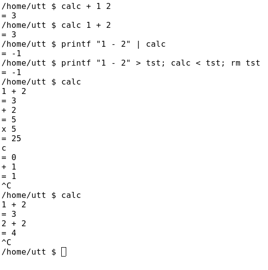

# calc

CLI calculator using Polish-ish notation written in C.

## Getting started

```sh
cc -o /usr/local/bin/calc calc.c
```

## How to

```sh
calc (number) [action number(s) ...]
```

* number(s) - integers and floats are allowed
* action
    * `+` - add given numbers to the result;
    * `-` - subtract given numbers from the result;
    * `x` - multiply result with given numbers;
    * `/` - divide result with given numbers;
    * `^` - raise the result to the power of given numbers;
    * `v` - take squareroot of the result;
    * `c` - clear the result, i.e. nullifies the result.

Numbers and actions don't have to be separated by spaces, any other non-action character can be used.

`calc` takes input in 4 ways:

* commandline arguments;
* from stdin;
* piped in from a file;
* from user input in REPL mode.


## Examples



For those who want to try out the same commands.

```sh
/home/utt $ calc + 1 2
= 3
/home/utt $ calc 1+2
= 3
/home/utt $ printf "1 - 2" | calc
= -1
/home/utt $ printf "1 - 2" > tst; calc < tst; rm tst
= -1
/home/utt $ calc
1 + 2
= 3
+ 2
= 5
x 5
= 25
c
= 0
+ 1
= 1
c
= 0
1 + 2
= 3
2 + 2
= 4
^C
/home/utt $
```


## Author

Meelis Utt
